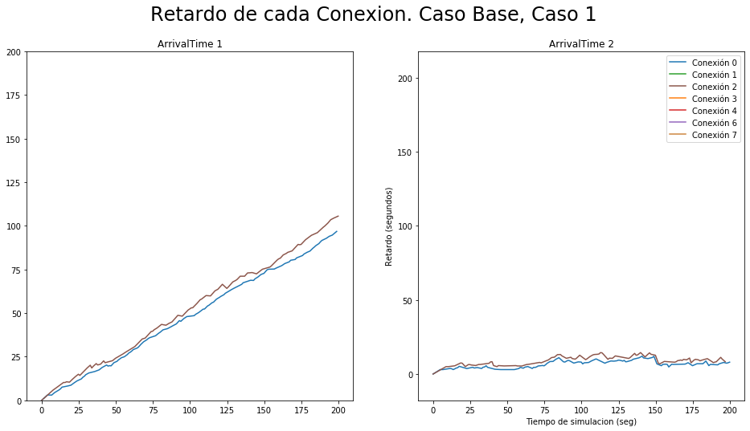
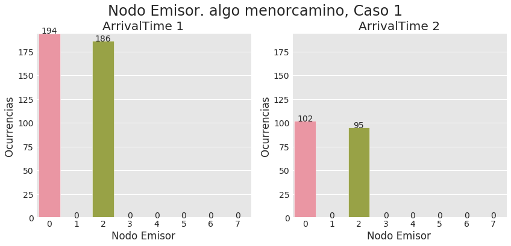

# Laboratorio de Simulación de Red

*Bordón Mauro Ezequiel - De Pascuale Matias - Sosa Manuel*

*FAMAF UNC*

---
# Evaluación de desempeño de distintos algoritmos de enrutamiento en una topología de anillo

## Abstract

En este informe analizaremos como actúan distintos algoritmos de enrutamiento y qué consecuencias tienen en una red con topología de anillo. Dichos algoritmos estarán orientados a la velocidad y a la distribución, y serán contrastados entre ellos y contra una implementación inicial básica. Nuestro objetivo es que estos algoritmos mejoren el desempeño de la red en comparación con la implementación inicial, por lo tanto simularemos discretamente una red con determinadas características que corra las distintas estrategias de enrutamiento y obtendremos datos que, bajo distintas gráficas, mostrarán la efectividad de nuestros algoritmos y su forma de accionar en distintos escenarios de ejecución.

---
## Introducción

### Enrutamiento

Uno de los problemas mas extensos de la comunicación en redes es el problema del enrutamiento. Este problema se trabaja en la capa de red, y consiste en hacer uno de los trabajos mas importantes y difíciles de la comunicación: `conectarlos`. En capas superiores esta conexión está asumida, los procesos se hablan directamente. En este nivel es en el que hacemos la magia de, dado un par emisor y receptor, buscar una ruta óptima para que se comuniquen. Y esta ruta no es para nada trivial, es justamente el principal problema, pues para transmitir los datos, estos tienen que pasar por muchas instancias intermedias, de las que no se tiene información inmediata, y además son compartidas por muchos emisores y receptores simultaneamente. Se agregan factores, pues tenemos que considerar que los enlaces entre instancias tienen distintas velocidades, y cada enlace puede transportar un solo paquete a la vez, lo que hace que una instancia con muchos paquetes para enviar por el mismo enlace, tenga que retenerlos. Esto último no es un detalle, pues puede causar congestión y grandes demoras en la comunicación. Y por si fuera poco, esta fragmentación independiente de instancias no es fiable en el sentido que cualquier instancia puede dejar de funcionar. El problema de enrutamiento consiste entonces en encontrar la ruta mas rápida para una conexión, pero además tiene que adaptar ese camino al estado de la red constantemente, todo esto sin tener información inmediata de las instancias intermedias que puede usar. Veremos en este informe distintos algoritmos de enrutamiento para una red con topología de anillo. Esta red nos garantiza varias precondiciones que facilitarán la tarea del enrutamiento.

### Routing y Fowarding

Cabe destacar que existen dos subdivisiones en la algoritmia que decide la ruta óptima del paquete: Routing y Fowarding.

Los algoritmos de routing son los que planifican cual será el camino que seguirá el paquete a lo largo de todo el trayecto, y es la tarea mas difícil, pues para eso es necesario mucho cálculo y consulta con otros nodos. 

Los algoritmos de fowarding son los que, cuando llega un paquete al nodo, calculan donde enviarlo. Estos algoritmos son mas simples, ya que están limitados solamente a sus vecinos y la información necesaria para decidir suele venir incorporada en el paquete que llega.

### La red

Trabajaremos sobre una red de topología de anillo. Esto significa que los nodos tienen dos vecinos, y enlaces para cada uno, de forma circular, como podemos ver en la imagen.

La ventaja de este tipo de red es lo simple que puede hacer el problema de enrutamiento. En primer lugar, el fowarding es trivial; si viene un paquete por un lado, y lo mandamos por el otro, tenemos garantizado que el paquete llegará eventualmente a su destino. Siguiendo esa linea de pensamiento, el routing también se simplifica, pues tendremos solo dos caminos posibles y ambos llegarán al destino, por lo tanto, en principio no tenemos que pedir información a ningún nodo para planificar la ruta.

Sin embargo, las desventajas de este tipo de red son notables; en primer lugar son pocas conexiones, lo cual, sin una buena velocidad de enlace, puede generar congestión por el simple hecho de que todos los emisores están forzados a usar las mismas rutas. Este problema empeora si consideramos el caso de que se puede perder un nodo, y si se pierden mas, se descomunican nodos por completo. En segundo lugar, la falta de rutas intermedias tiene como consecuencia que algunas conexiones están forzadas a ser subóptimas, pues para llegar desde un nodo hasta el opuesto hay que pasar por todos los intermedios sí o sí.

Las características de nuestra red son:
- Todos los nodos pueden emitir y recibir paquetes
- Los nodos inicialmente no tienen información de cuantos nodos hay en el anillo
- Cada nodo tiene dos enlaces bidireccionales con sus vecinos
- La velocidad de todos los enlaces es la misma (1Mbps)
- Los nodos no tienen límite de cuantos paquetes pueden almacenar
- El tamaño los paquetes generados es de 125000 bytes
- Los nodos están ordenados
- Los nodos no se desconectan

Sobre esta red analizaremos distintos algoritmos de enrutamiento para mejorar el desempeño general.

### Los casos

En este informe estudiaremos el comportamiento y efectividad de distintos algoritmos de enrutamiento. Para lograrlo, trabajaremos en dos casos distintos:
- Caso 1: Sólo dos nodos en la red (nodo 0 y nodo 2) generan tráfico a un solo nodo (nodo 5).
- Caso 2: Todos los nodos (0,1,2,3,4,6,7,8) generan tráfico hacia un solo nodo (5).

En ambos casos, todos los nodos generarán paquetes a la misma velocidad.

A través de estos casos de análisis, utilizando distintas métricas, determinaremos que tan bien estamos usando los recursos de la red y a partir de que velocidad de generación de paquetes podemos garantizar que esta red esté equilibrada.
 
### Los escenarios

Además, para ambos casos planteamos cinco escenarios distintos, en los que variaremos la velocidad en la que se genera tráfico para todos los emisores, de manera que se vean los efectos de los algoritmos en distintas condiciones de carga.
Los intervalos de generación de paquetes que usaremos serán distribuciones exponenciales centradas en `0.1 , 1 , 2 , 3.5 y 7 segundos`.

### Las mediciones

Para llevar a cabo nuestro experimento, simularemos una red en los casos y escenarios anteriormente descriptos, durante 200 segundos, y tomaremos las siguientes métricas:
- Delay individual

En esta gráfica mostraremos, para cada nodo, cuanto tardaron en llegar sus paquetes al destinatario. A través de esta gráfica esperamos ver cuánto perjudica a cada nodo el algoritmo.

- Delay general

En esta gráfica mostraremos cuanto tardaron en llegar todos los paquetes de la red. Su propósito es mostrar cuanto está congestionando a la red el algoritmo.

- Ocupación de los buffers

En esta gráfica veremos la máxima cantidad de paquetes que hubo en cada buffer, y el promedio de paquetes que tuvo. Podremos observar cuan distribuida está la carga en la red.

- Paquetes procesados por nodo
  
En esta gráfica veremos, para cada nodo, la cantidad de paquetes que pasaron por el. Veremos con esta gráfica cuan equitativo es el algoritmo a la hora de elegir rutas.

- Cantidad de saltos de los paquetes
  
En esta gráfica mostraremos cuantos paquetes hicieron determinada cantidad de saltos. Con esto analizaremos si las rutas usadas son las mas cortas.

- Paquetes recibidos
  
En esta gráfica veremos, para cada nodo, cuantos paquetes fueron recibidos por el receptor. Muestra si el algoritmo está dandole mejores caminos a algunos nodos.

- Estabilidad
  
Además, solo para el caso 2, tomaremos una medida de 1000 segundos para ver cómo varía el delay general. Veremos si la red es estable si el delay crece o se mantiene constante.

### Algoritmo base

De manera introductoria y para luego comparar desempeño, estudiaremos un algoritmo de enrutamiento muy simple y "tonto". 
Cuando a un nodo le llega un paquete que no era para el, lo envía a su vecino en sentido horario. Si era para el, lo consume. Notemos que este algoritmo aprovecha la topología de anillo para no hacer absolutamente nada de routing, y con un fowarding muy simple tiene garantizado que los paquetes llegan a destino.

---
## Resultados iniciales

Veamos los datos que conseguimos corriendo el algoritmo base en nuestra red de anillo:

#### Delay general

Podemos observar que en el caso uno, cuando solo tenemos dos emisores, parece no andar demasiado mal. Cuando el intervalo de generación de paquetes es mas largo que dos segundos, el retardo es bastante estable. Sólo cuando se acerca a un segundo vemos que empieza a tener problemas, pues el delay comienza a crecer bastante rápido.

Sin embargo, para el caso dos, es otra la historia. El intervalo de generación tiene que ser bastante lento (7 segundos) para que el delay sea manejable; algunos segundos menos y podemos observar la velocidad a la que crece.

#### Delay individual

En el primer caso, se observa que este algoritmo es bastante parejo; ambos nodos tienen un retardo promedio muy similar, incluso cuando el delay está creciendo, crece parejo.

En el segundo caso vemos que, a medida que disminuye el intervalo de generación de paquetes, crece la distancia entre los distintos delays. Sin embargo, parecería que el delay mas bajo tiende a acercarse a los delays mas altos. Esto se produce porque el nodo mas cercano al receptor en sentido antihorario tiene y usa la ruta mas corta siempre, y llenará los buffers finales con mas paquetes suyos.

#### Ocupación de los buffers

Podemos observar como en el caso 1, para intervalos de generación mayores a dos segundos, casi que no se retienen paquetes en los buffers. Pero si llevamos el intervalo a un segundo, tenemos un sólo buffer que explota de paqutes. Esto se debe a que como ambas rutas son horarias, se cruzan en un punto; es ahí en donde se produce la congestión.

En el caso dos, observamos que a medida que aumenta la velocidad de envío de paquetes, todos los buferes excepto dos se sobrecargan a un ritmo muy similar; esta situación se da siguiendo la lógica del caso 1, pero ahora todos los nodos interceptan la ruta del nodo anterior, excepto el nodo receptor, y el nodo mas cercano al receptor en sentido antihorario.

#### Paquetes procesados

En esta gráfica observamos que, en el caso 1, hay un casi balance en cantidad de paquetes que tiene que procesar cada nodo. Lo primero en romper ese balance es que algunos nodos no procesan paquetes; esto se da porque están en sentido antihorario del emisor mas lejano. Lo segundo en romperlo, son los nodos entre receptores; en intervalos mas largos, solo procesan los nodos de un emisor, y los nodos finales los de dos emisores. Sin embargo, este fenómeno se deshace en intervalos mas cortos, esto sucede porque el cuello de botella no puede actuar mas rápido, entonces envía su máximo. Esto nos da el primer indicio de una noción relevante: la capacidad máxima de información que puede transmitir este algoritmo.

En el caso 2, en cambio, observamos un fenómeno diferente. En principio se escalona, naturalmente, la cantidad de paquetes procesados, pues mientras mas cerca esté un nodo del receptor, formará parte de mas rutas. Sin embargo, a medida que avanza la velocidad de generación, llega un punto en que los paquetes procesados comienzan a crecer paralelamente. Esto se debe a que el alto delay hizo que todos los nodos lleguen a su máxima capacidad de transmisión, entonces todos los nodos reciben paquetes igual de rápido, sin importar la velocidad de generación. Excepto por el nodo vecino antihorario del receptor, que no recibe paquetes.

#### Cantidad de saltos

En el caso 1 vemos un comportamiento bastante trivial; como la ruta nunca varía, y hay dos emisores, solo hay dos posibles cantidades de saltos que puede hacer un paquete. La pequeña diferencia que se observa, se da porque el nodo mas cercano envía mas paquetes, pues los envía mas rápido.

En el caso 2, el comportamiento no es tan trivial. Para los casos mas rápidos, se ve claramente un escalón que favorece a los paquetes de menores saltos. Esto es porque los nodos mas cercanos en sentido horario tienen que pasar por menos puntos de congestión, por lo tanto pueden llegar al receptor mas facilmente. En los casos mas lentos, en cambio, se ve equilibrio, pero una pequeña tendencia a los paquetes con mas saltos. Esto no es casualidad, dicha tendendicia es producto de un fenómeno muy curioso; como el nodo mas lejano no está recibiendo paquetes de nadie, todos los paquetes que envía por la ruta son suyos. El resto de los nodos, en cambio, tiene que intercalar entre paquetes suyos y paquetes de otro nodo. La cantidad de paquetes del último nodo se van reduciendo por cada nodo que atraviesan, pero esa pequeña ventaja le otorga un poco mas presencia en estos casos.

#### Paquetes recibidos

Ambas gráficas reafirman las conclusiones alcanzadas en las gráficas de cantidad de saltos; incluso, como este algoritmo tiene para cada nodo una cantidad única de saltos, se podría decir que en este caso ambas métricas son equivalentes. 

#### Estabilidad de la red

Vemos en esta gráfica que el delay general no es para nada bueno. En intervalos de generación de 6 segundos, con muchos emisores, el delay no para de crecer. Incluso para los nodos mas beneficiados, el crecimiento es lineal. Si esta red corriese por tiempo extendido, evidentemente colapsaría.

La gráfica de delay general promedio muestra claramente qué velocidad de generación necesitamos para que en esta red se pueda garantizar estabilidad, 7 segundos.

### Análisis

Las métricas obtenidas nos indican varias cosas sobre el algoritmo, pero hay una que puede englobar a todas: Este algoritmo no está usando la capacidad de la red. Básicamente, consecuencia de que este algoritmo use la misma ruta para todos los emisores, y que no ocupe la mitad de los enlaces, genera acumulación de paquetes en los buffers y un delay horrible. Sólo funciona cuando hay pocos emisores y el intervalo de generación es mayor a dos segundos, pero con mover cualquiera de esas dos condiciones la red queda peligrosamente congestionada. Con muchos emisores, este algoritmo falla incluso en los escenarios mas lentos. Y claramente, no se puede garantizar estabilidad en una red real con este algoritmo.

---
## Métodos

Nuestro objetivo en este informe es diseñar estrategias de enrutamiento que mejoren el desempeño de la red con respecto al algoritmo base ya analizado. Llegamos a dos soluciones distintas, partiendo de conceptos intuitivos: El `Algoritmo de Menor Camino`, que busca usar el camino mas corto desde emisor a receptor, y el `Algoritmo Alternante`, que busca maximizar el uso de los distintos enlaces de la red. A continuación, una explicación de como funcionan ambos algoritmos, y como evolucionó su desarrollo.

### Algoritmo de Menor Camino

#### Motivación
La necesidad de encontrar un enrutamiento optimo para que nuestra red entregue de la mejor manera los paquetes a los diferentes nodos que la conforman lo primero que se nos ocurrio fue basicamente buscar el menor camino a recorrer, de esta forma nuestros paquetes llegarian lo antes posible a su destino.

Al igual que su nombre nos indica este algoritmo nos ayuda a encontrar el menor camino para el envio de nuestro paquete.
Para realizarlo tuvimos dos instancias:

#### Primera instancia
En esta instancia, el algoritmo supone:

* El tamaño de la Red es dado.
* Los nodos estan ordenados.
* No van a existir desconexiones de nodos.

Al suponer el tamaño de la red nuestro algoritmo se volvio muy facil de crear. Como ya sabiamos el destino y la fuente del paquete realizabamos para cada paquete un calculo basico para saber cual era el camino mas corto, si por izquierda o derecha. El calculo constaba de ver la distancia entre el nodo emisor y el nodo receptor y segun este si la diferencia era menor a la mitad de la red basicamente lo mandabamos por la compuerta que debia ser.

Al crearlo se consiguio que los paquetes encontraran el menor camino y de esta forma el algoritmo cumplio con su objetivo, mejorar el enrutamiento.
Pero existia un problema. No podemos asumir que tamaño tenia la red Anillo, entonces debiamos mejorar el algoritmo de forma que funcione para un tamaño N.

#### Segunda instancia

Para esta segunda instancia, relajamos una suposición, solo suponemos:

* Los nodos estan ordenados.
* No van a existir desconexiones de nodos.

Ahora que ya no suponemos el tamaño de la red es necesario calcularlo ya que es la base de nuestro algoritmo. Para esto nosotros en la inicialización de la red realizamos desde cada uno de los nodos de la red el envio de un paquete especial vacio a si mismos, de esta forma el nodo al recibir el paquete que envio puede verificar cuantos saltos dio y con este numero calcular el "RingSize" o tamaño de la red.

Ahora como ya sabemos el tamaño de la red, con pequeñas modificaciones a nuestro algoritmo se mantiene su funcionalidad y su objetivo. ya que ahora no tenemos un "numero magico" para el tamaño de la red sino que tenemos un numero calculado y seguro.

El algoritmo funciona exactamente igual, los nodos realizan un calculo en base al "RingSize" y la distancia entre el nodo emisor y receptor para elegir el menor camino a realizar.

### Algoritmo Alternante

#### Motivación
En el algoritmo del menor camino, vimos como rápidamente podemos conseguir el camino mas cercano desde el emisor al receptor y usarlo para comunicar los paquetes. Dicho algoritmo siempre será el mejor mientras la red sea lo suficientemente rápida, pues si los paquetes nunca esperan en un buffer entonces el delay será el menor posible. Pero si no están dadas estas condiciones óptimas, el algoritmo empieza a sobrecargar los buffers de los mismos nodos.

La motivación del algoritmo alternante es aprovechar todos los enlaces de la red, usarla a su máxima capacidad para evitar que los caminos mas cortos se sobrecarguen de paquetes. Nuestro objetivo es que, a través de la distribución de paquetes en la totalidad de la red, el delay sea mas estable en casos menos óptimos.

#### Primera instancia
El objetivo de distribuir los paquetes en toda la red se cumplió con un algoritmo muy simple: Cada nodo emisor alterna el camino por el que manda un paquete entre izquierda y derecha, cada vez que manda un paquete. Si un nodo no receptor recibe el paquete desde la izquierda, lo manda a la derecha, y viceversa, hasta que el paquete llega al receptor. 

Este algoritmo ya consiguió el resultado esperado, en terminos de estabilidad logró una gran mejora y la utilización de la red resultó muy bien distribuida para todos los nodos. Probamos el algoritmo incrementando la cantidad de paquetes que se mandaban antes de alternar el camino de salida, pero lo mas óptimo siguió siendo uno solo.

El problema de este algoritmo simple fue el delay. En los casos mas óptimos, el delay promedio resultó un poco alto, pues para los emisores cercanos al receptor, un paquete llegaba rápido pero el otro llegaba considerablemente mas lento. Además, dependiendo que nodos eran emisores, algunos bufferes podían tener una diferencia apreciable de ocupación.

Nos dimos cuenta que podíamos ser mas inteligentes a la hora de alternar los caminos, y empezamos a hacer crecer el algoritmo.

#### Segunda instancia
Se nos ocurrió que podíamos hacer que el algoritmo no alterne el camino de salida cada un solo paquete, sino que vaya aprendiendo que camino es mejor y alterne mas hacia ese lado. Es decir, si el camino óptimo es a la derecha, mandará cuatro paquetes por la derecha y uno por la izquierda, y así sucesivamente. Rápidamente nos dimos cuenta que esto podría sobrecargar los caminos, haciendolos mas lentos. Por lo tanto incorporamos una solución a ese problema también. Para implementar esta algoritmia, lo único que necesitamos fue enviar paquetes ligeros de comunicación desde el receptor al emisor, y un poco de lógica interna.

Diseñamos un algoritmo que se adapte a los distintos estados de la red:
- Se empiezan a mandar paquetes con la primera versión del algoritmo alternante (Alternando en uno).
- Cada vez que un receptor recibe un paquete, calcula su retardo y lo promedia con los retardos anteriores.
- Si el retardo del nuevo paquete es `menor` que el promedio, le comunicamos al emisor, a través de la ruta por la que llegó el paquete, que esta ruta `"es buena"`
- Si el retardo del nuevo paquete es `mayor` que el promedio, le comunicamos al emisor, a través de la ruta por la que llegó el paquete, que esta ruta `"no es buena"`
- Cuando el emisor recibe el mensaje de que la ruta es buena, aumenta la cantidad de paquetes que manda por la ruta que le llegó el mensaje
- Cuando el emisor recibe el mensaje contrario, disminuye la cantidad de paquetes que manda por esa ruta

Cabe destacar que decir "mayor/menor" al promedio no es estrictamente mayor, sino con una diferencia determinada con el promedio, a la cual llamamos `tolerancia`.

Este algoritmo mostró un buen funcionamiento, se adaptaba bien a las rutas en los casos mas óptimos y conseguía buen delay general. Variamos la tolerancia con la que comparamos el nuevo delay con el delay promedio, y vimos que la mas balanceada es:
- Si el delay nuevo multiplicado por 1.3 es menor que el delay promedio o bien;
- Si el delay nuevo es menor que el delay promedio multiplicado por 1.3.

Además, evaluamos distintas formas de aumentar la cantidad de paquetes enviados. Nuestra primera aproximación fue sumar de a un paquete, lo que resultó en un crecimiento bastante lento. Probamos sumar distintas constantes pero los valores que mejor se adaptaban a la red fueron:
- Si la ruta es buena, duplico la cantidad de paquetes que le mando antes de alternar
- Si la ruta es mala, divido en dos esa cantidad
- Si la ruta es mala y está mandando un paquete antes de alternar, duplico la otra ruta.

Si bien este algortimo funcionó en casos óptimos, en casos menos optimos notamos comportamientos muy extraños. Esto es porque el algoritmo tenía varios problemas. Lo que nos llevó a una nueva instancia del algoritmo.

#### Tercera Instancia 

Esta implementación es la implementación final del algoritmo. En la implementación anterior, el algoritmo tenía un comportamiento muy extraño; para ciertos emisores, al receptor nunca le gustaban sus rutas. Es decir, a ambas rutas les mandaba feedback negativo. Esto, en los casos de red menos óptima, le pasaba a todos los nodos emisores. El problema residía en dos casos que no estabamos considerando:

- Multiples emisores, múltiples promedios.
Si un emisor tenía una ruta muy rápida al receptor (ie; eran vecinos), y otro emisor solo tenía rutas largas (ie; eran opuestos), entonces el emisor lento nunca iba a tener feedback positivo. Esto es, porque el delay estaba muy contaminado por el emisor vecino, que tenía un delay casi nulo. La solución a este problema fue fácil; cada receptor guardaría una lista de los emisores que le envían paquetes, con su promedio individual asociado. De esta manera, todos los nodos emisores pueden tener rutas óptimas.

- Mala adaptación del promedio.
Notamos que en los casos en que la red se congestiona rápidamente, todos los feedbacks eran negativos. Esto se debe a la mala adptación de una función de promedio pesado a los cambios de congestión de la red; si el delay de los paquetes aumenta inevitablemente por la cantidad de tránsito en la red, el promedio siempre considerará los casos donde la red andaba mas rápido, por lo tanto no es una buena función para evaluar los paquetes que están llegando ahora. Decidimos entonces cambiar la función promedio por una función `R+1 = R * alpha + M * (1 - alpha)`, donde R es el rate actual, R+1 será el nuevo rate, M es nuestra última medición y alpha es un valor entre 0 y 1. Con esta función pudimos conseguir que los últimos paquetes recibidos tengan mucha mas influencia en el valor almacenado para comparar la velocidad de las rutas.

Con estas soluciones, logramos que el algoritmo sea mucho mas estable y eficiente, tanto en casos de red óptima como no óptima. Luego de experimentar con distintas alternativas, establecimos el valor de `alpha` en 0.6, un valor bastante bajo que le da mucha importancia al último valor obtenido. Sin embargo, creemos que distintos valores de alpha en combinacion con distintas tolerancias, se pueden conseguir mejores resultados que los que estamos por exponer.

---
## Resultados

#### Delay general

- Algoritmo Menor Camino

Para pocos emisores, vemos como para los intervalos mas rápidos, el delay general aumenta muy poco en comparación con los intervalos mas lentos, y se mantiene constante. 

En comparación con el caso base se puede observar una mejora muy grande, pues en los casos mas rápidos el delay crecía linealmente y ahora necesitamos mucha mas velocidad para llegar a ese escenario.

En el caso de muchos emisores, el algoritmo de menor camino mantiene el crecimiento lineal del delay general para los casos mas rápidos. Y con otras velocidades mas bajas el crecimiento empieza a dejar de ser lineal y empieza a parecerse mas a una constante ya que oscila en un rango de segundos. 

Esto es una mejora respecto al algoritmo base en el umbral a partir de cual se da el crecimiento lineal; en el algoritmo base necesitamos velocidades muy lentas para que se mantenga constante, ahora en velocidades medias el algoritmo tiene un buen desempeño.

- Algoritmo Alternante
  

Idénticamente al algoritmo de menor camino, para pocos emisores observamos claramente resultados desables y grandes mejoras en comparación al algoritmo base.

Similarmente al algoritmo de menor camino, tenemos crecimiento lineal en los casos mas rápidos, constantes en los casos medianos y lentos, y mejoras respecto al algoritmo base.

Sin embargo, vemos como consecuencia del algoritmo alternante, que los rangos de variabilidad del delay general son muchísimo mas amplios; podemos observar como el delay promedio crece mas lento.

#### Delay individual

- Algoritmo Menor Camino

Como podemos observar, en el caso de pocos emisores, tanto en escenarios rápidos como en escenarios lentos el delay individual de cada nodo es bastante similar. Esto nos indica que el algoritmo está siendo justo con los nodos. Sin embargo, cabe aclarar que esta situación se da porque los dos nodos emisores están a la misma distancia del receptor, lo que hace que ambos tengan caminos de la misma longitud, y separados entre sí. 

En el caso base, vimos una conducta similar; los delays crecen paralelamente aunque a una velocidad mucho mayor.

En el caso de muchos emisores, vemos que el delay de todos los emisores crece muy parejo a excepción de dos delays, que se separan del promedio. Estos son los dos nodos vecinos del receptor, que tienen el camino mas beneficiado.

Si bien el crecimiento es considerablemente mas lento, este comportamiento es similar al del caso base; la única diferencia es que ahora son dos los nodos que tienen el camino descongestionado.

- Algoritmo Alternante
 

En el caso de pocos emisores, el algoritmo alternante es justo entre nodos. Tanto para escenarios rápidos o lentos, el delay es muy parecido para ambos emisores.

Tiene un comportamiento similar al del caso base, si bien los delays son mucho menores, se distribuyen igual entre nodos.

En el caso de muchos emisores, sin embargo, vemos uno de los objetivos de nuestro algoritmo: equidad. Si bien a medida que crece la velocidad, los nodos mas cercanos al receptor tienen los delays mas bajos, también usan rutas que les generan los delays mas altos. De esta manera, podemos garantizar un delay promedio muy similar para todos los nodos.

Comparado con el caso base esto es una gran mejora, pues no sólo conseguimos mejores delays sino que además, están bien distribuidos por entre todos los nodos.

#### Ocupación de los buffers

- Algoritmo Menor Camino

Se puede apreciar en esta gráfica que la congestión es bastante poca en ambos intervalos de generación, pero también podemos ver qué buffers se están usando mas que otros. Particularmente, los emisores son los mas cargados pues en intervalos mas rápidos pueden generar paquetes antes de terminar de enviarlos, pero es el único caso donde apreciamos acumulación de paquetes.

Respecto al caso base, está claro que hubo una mejora, pues en el caso base veíamos congestión producto de la intersección de caminos, y en este caso (y dados dos emisores particulares) no existe dicha intersección.

Para el caso 2, sin embargo, son otros los resultados. Vemos como, a medida que disminuye el intervalo de generación, crece la ocupación en los buffers. Se puede apreciar congestión en los casos mas rápidos, con la mitad de los buffers en alta ocupación, y la otra mitad vacíos. Esto se debe a la naturaleza del algoritmo; los buffers tienen ocupación solo del lado que genera un camino mas corto. Una mitad de los buffers tendrá ocupación escalonada horariamente, la otra mitad tendrá ocupación escalonada antihorariamente. El buffer opuesto es el único que envía por ambos lados, y no recibe ningún paquete.

Si bien la ocupación es considerablemente mejor que en el caso base, podemos ver la razón de la congestión a medida que crece la velocidad; este algoritmo genera dos instancias del algoritmo base, una en sentido horario y otra en sentido antihorario. Lo que consigue entonces, es escencialmente, dividir los problemas del algoritmo base en dos. 

- Algoritmo Alternante
  

Similar a lo analizado para el algoritmo de menor camino, para pocos emisores no vemos congestión y la desigualdad en acumulación de paquetes se dá porque el emisor genera mas rápido de lo que envía. 

Respecto al caso base, tenemos mejoras ya que al variar siempre las rutas, no tenemos puntos fijos de intersección, evitando la congestión.

Para muchos emisores podemos observar un comportamiento muy curioso. Para los intervalos mas altos, la carga está bastante distribuida y no vemos indicios de congestión, pero para los intervalos mas bajos la congestión empieza a crecer paralelamente en todos los enlaces, con algunas excepciones. En primer lugar, el crecimiento comienza en los enlaces mas cercanos al receptor, en ambos sentidos horario y antihorario, mientras que en esos nodos, en el sentido opuesto, el buffer está vacío. Esto se debe a que muchas rutas empiezan a tomar ese camino como uno recomendado, entonces comienzan a mandar paquetes en esa dirección; mientras que los únicos que mandan paquetes en la dirección opuesta son esos mismos nodos, y mandaran pocos paquetes pues es una ruta no recomendada. Los nodos intermedios, en cambio, mandarán en ambos sentidos. Este comportamiento se acentúa a medida que disminuye el intervalo de generación, lo que termina transportando los mayores puntos de congestión desde los nodos finales a los nodos intermedios.
Por último, no olvidemos que nuestro algoritmo puede estar enviando muchos paquetes de feedback, que también se acumulan en nuestros buffers, generando mas congestión.

Consideramos esto una mejora respecto al algoritmo base, pues necesita mucha mas velocidad para congestionarse, y cuando la congestión se da, no está concentrada en un cuello de botella, sino bien distribuida entre nodos

#### Paquetes procesados

- Algoritmo Menor Camino

Apreciamos en esta gráfica como se distribuye la carga entre nodos. Es bastante el equilibrio que se da pues, como mencionamos, los caminos son disjuntos; entonces ningún nodo recibe paquetes de dos nodos distintos. La situación que se da es que el nodo 1, como está entre ambos emisores, no recibe ningún paquete en lo absoluto.

Esta implementación supera al caso base pues el equilibrio que se consigue es notorio.

Para el caso dos, en cambio, empezamos a ver un comportamiento no tan equilibrado. El nodo 1 procesa menos paquetes, pues no recibe de nadie, sus vecinos procesan un poco mas, pues reciben del 1, y así acumulativamente hasta el receptor.

Si bien mejora el desempeño y el balance respecto al caso base, nos lleva a retomar una conclusión; este algoritmo divide al caso base en dos.

- Algoritmo Alternante

Podemos apreciar en este escenario como el algoritmo alternante consigue un balance para todos los nodos excepto los emisores. Esto se da porque son los que originan el flujo, y si bien lo dividen equitativamente, ellos la generan en su totalidad, y reciben paquetes que generó el otro, aumentando planamente los paquetes que procesan por sobre los otros nodos.

Respecto al caso base, esto es es una gran mejora, pues conseguimos que sea bastante mas equitativo, aunque hace actuar mas a los nodos.

Para el escenario de muchos emisores, en cambio, vemos un comportamiento ya analizado. Para los casos de intervalo de generación mas alto, vemos un balance perfecto. Pero a medida que baja, los nodos intermedios tienden a procesar mas paquetes. Esto se da porque los nodos finales alternan menos sus rutas, ya que encuentran rutas recomendadas facilmente, mientras que los nodos intermedios las alternan mucho mas.

Respecto al caso base es una mejora clara en la distribución de tareas, pero sigue siendo notable que los nodos deben actuar mas en total.

#### Cantidad de saltos

- Algoritmo Menor Camino

Como podemos observar la cantidad de saltos se concentra únicamente en 3. Esto se debe a que nuestro algoritmo busca el menor camino entre el nodo emisor y el nodo receptor por lo tanto la cantidad de saltos de cada paquete sera la menor posible. Esto, en combinación con el hecho de que los nodos emisores elegidos están a tres nodos de distancia del receptor, dan como resultado que no exista cantidad de saltos distinta a 3. 

Respecto al caso base la mejora es obvia; la finalidad de este algoritmo es hacer esta métrica inmejorable.

Gracias a nuestro algoritmo podemos observar que la cantidad de saltos nunca es mayor a la mitad de la cantidad de nodos que hay en la red. Mas aún, el único nodo que envía paquetes que tienen 4 saltos es el opuesto, mientras que para el resto de valores hay dos nodos que envían con esa cantidad.

Sin embargo, en los intervalos mas cortos apreciamos una mayor cantidad de paquetes de un salto, que del resto. Esto se debe a que se generó congestión, y evidencia que los paquetes a un salto de distancia tienen la ruta mas rápida; algo que ya habíamos descubierto en análisis anteriores.

Esta mejora es evidente respecto al caso base, sin embargo muestra un problema similar que es la tendencia a favorecer a los nodos a un salto de distancia. 

- Algoritmo Alternante

Podemos apreciar que, como consecuencia de distribuir la carga en la red, el algoritmo alternante muestra que varía entre el camino mas corto y el camino mas largo, para ambos nodos. Este numero tiende al camino mas corto a medida que el intervalo de generación es mas lento.

En comparación con el caso base, vemos una distribución idéntica pero una cantidad considerablemente mayor. Esto nos indica que, a pesar de mantener la cantidad de saltos, nuestro algoritmo congestiona menos la red.

Para muchos emisores notamos la métrica se escalona a medida que disminuye el intervalo de generación, priorizando a los paquetes con un solo salto. Sin embargo, en los intervalos mas lentos vemos balance para los valores intermedios y desigualdad en los valores de los extremos. Este comportamiento se atribuye a dos razones; las rutas con mas saltos son no recomendadas por el algoritmo y viceversa, lo cual genera tendencia a usar las rutas cortas; y por otro lado la congestión se genera en los nodos intermedios, por lo tanto el receptor recibe mas paquetes de sus vecinos.

En comparación con el algoritmo base, vemos muchas similitudes en la distribución; sin embargo las cantidades transmitidas nos indican que esas similitudes son generadas por como funciona el algoritmo, y no por la congestión que genera. 

#### Paquetes recibidos

- Algoritmo Menor Camino

Se aprecia en el balance de la cantidad de paquetes recibidos que nuestro algoritmo, para pocos emisores, tiene un buen balance de utilidad para nodos emisores. La diferencia está dada por la cantidad de paquetes generados; las distintas mediciones hacen que las diferencias varíen muy poco.

Se ve la diferencia con el caso base que, claramente, beneficiaba a un emisor por sobre el otro.

Vemos en el caso 2 que, para los casos mas lentos tenemos estabilidad, pero para los casos mas rápidos volvemos a generar los escalones que tienden a los nodos vecinos del receptor. Esto se da por la congestión generada entre medio, la carga útil favorece a quien esté mas cerca del receptor.

Respecto al caso base mejoramos el desempeño; la cantidad de paquetes recibidos es notablemente mayor y estamos un buen tiempo con valores balanceados. Sin embargo, con el comportamiento escalonado llegamos de nuevo a la misma noción de que este algoritmo termina dividiendo al caso base en dos.

- Algoritmo Alternante

Para el algoritmo alternante tenemos un resultado idéntico al algoritmo de menor camino, en el escenario de pocos emisores. 

Sin embargo, la mejora respecto al caso base se da por la mejor utilización de todos los recursos de la red.

Para el escenario de varios emisores tenemos un resultado interesante. A pesar del esfuerzo del algoritmo para balancear la carga util de los nodos, seguimos viendo un comportamiento escalonado que tiende a los nodos mas cercanos al emisor. Esto se da por la adaptabilidad del algoritmo, que tiende a recomendar las rutas inmediatas. Estimamos que con una investigación mas profunda sobre la tolerancia y el alpha, podemos disminuir estos escalones.

En comparación con el algoritmo base, si bien mantenemos un comportamiento que tiende a ser escalonado, los escalones son mucho menos bruscos, mantenemos balance por mas tiempo, y el total de paquetes que se procesa es mayor.

### Estabilidad de la red

- Algoritmo menor camino
  

Vemos en esta gráfica que el delay general es bastante controlable; con muchos emisores, si bien crece linealmente, no es un crecimiento muy pronunciado para la velocidad de generación de paquetes.

La gráfica de promedio de delay general muestra en qué intervalo de generación podemos garantizar estabilidad, pues mientras tengamos intervalos en mas de 3,5 segundos no crecerá el delay. Y si bien a partir de los 3 segundos el delay empieza a crecer, no es de manera tan pronunciada como en el caso base.

- Algoritmo alternante

Vemos en esta gráfica una gran variabilidad en los tiempos de delay que se registran. En un intervalo de generación de tres segundos, la distancia entre los delays mas bajos y altos crece y decrece como una función trigonométrica, mientras que aumenta cada vez mas. Esto nos da una noción de que este algoritmo puede conseguir estabilidad en intervalos mas bajos, pero para ello necesitamos establecer las constantes que lo determinan con mas precisión.

La gráfica de delay general muestra cuando podemos garantizar estabilidad en nuestro algoritmo; esto es cuando el intervalo de generación de paquetes no baje de los 3,5 segundos.

### Conclusión de los resultados

Dados los resultados de las métricas analizadas, podemos concluir que ambos algoritmos son mejores que el caso base en todo escenario. Concluiremos ahora las características escenciales de cada algoritmo. 

#### Algoritmo de Menor Camino

Este algoritmo cumple en la totalidad su función de usar el camino mas corto para mandar los paquetes. Lo que muestran los datos, sin embargo, es que el camino mas corto no siempre es el camino mas óptimo. Este algoritmo genera congestión de manera escalonada en los distintos nodos, y no es equitativo, pues los nodos mas cercanos al receptor tienen beneficios. En varias ocasiones pudimos apreciar que, a medida que disminuye el intervalo de generación, este algoritmo se comporta similar al algoritmo base, pero dividido en dos ramas. Dependendiendo que nodos sean los emisores, este algoritmo puede funcionar muy bien; sin embargo mientras mas nodos sean emisores, mas complicado es llegar a un desempeño óptimo. 

En definitiva, para redes rápidas es un algoritmo ideal; muy poco overhead, muy poco feedback y maximiza la velocidad de transmisión de la información. Sin embargo, para redes mas pesadas, se evidencia el desperdicio de recursos de la red, y se muestra mas posible la congestión.

#### Algoritmo Alternante

Este algoritmo cumple parcialmente su función de distribución. Otorga a los nodos delays que en promedio son similares, usa los recursos de la red uniformemente, pero al fin y al cabo llegamos a una situación que parece inevitable; los vecinos del nodo receptor se ven beneficiados en la carga útil que transmiten. 

Si bien otorga buenos tiempos de retardo, termina consumiendo muchos recursos de la red, quizás mas de los que necesita. Esto se debe tanto a la naturaleza de alternar rutas del algoritmo como a la cantidad de feedback que envía. En los casos mas rápidos, siguiendo la ejecución, se puede ver que sobreactúa bastante, enviando muchos paquetes de feedback al mismo emisor antes de que este tenga la oportunidad de actualizar su estado. Cuando aumenta la congestión en la red, falla en adaptarse a esta a la velocidad que necesita hacerlo. Insistimos en que estos comportamientos pueden ser regulados y optimizados, pues dependen de constantes que elegimos arbitrariamente y fuimos evaluando para un mejor funcionamiento.

En conclusión, este algoritmo funciona bien en redes rápidas, tiene algo de overhead y no siempre usa los caminos mas rápidos pero tiene un retardo general muy pequeño. En redes pesadas empieza a sufrir congestión, pero con un estudio de las constantes de tolerancia y alpha, se puede optimizar.

#### Comparación

Si bien ambos algoritmos tienen buen desempeño, queremos analizar cuando es uno preferible por sobre el otro. 

Para casos de redes muy rápidas, siempre será mejor el algoritmo de menor camino. Esto se da porque, en este tipo de redes, está hecho de manera que obtenganmos la mejor velocidad posible. 

Para casos de redes medianas y con pocos emisores, podemos usar ambos algoritmos, dependiendo la posición de los emisores y receptores. Si las rutas no se pisan, podemos usar el algoritmo de menor camino para conseguir la mayor velocidad, pues dificilmente congestionaremos. Pero si las rutas se intersecan, puede resultar conveniente el algoritmo alternante, pues podemos distribuir mejor la carga sobre los recursos de la red. 

Para casos de redes medianas con muchos emisores y redes pesadas, puede parecer que ambos algoritmos son iguales, pero el algoritmo alternante funciona mejor. Gracias a su uso distribuido de los recursos de la red, y su capacidad de adaptación, la congestión aumenta en una velocidad considerablemente menor que el algoritmo de menor camino. Sin embargo, si la red cambia de estado en cortos intervalos de tiempo, repetidas veces, el algoritmo alternante también fallará en adaptarse.

---
## Discusión

### Críticas a los algoritmos

Si bien nuestras implementaciones cumplieron nuestros objetivos, analizaremos que errores tuvieron
#### Algoritmo de Menor Camino

Por un lado, la implementación del algoritmo de menor camino depende mucho de que los nodos estén ordenados. Podemos ver que es posible relajar este requerimiento sin afectar el desempeño del algoritmo.

Por otro lado, pudimos tomar datos de casos con distintos emisores, ya que los dos emisores que fueron elegidos para el caso 1 resultaban en un escenario ideal del algoritmo.

Finalmente, no estamos considerando que algún nodo puede caerse. Si bien en una red de topología de anillo esto significa un gran golpe al desempeño, independientemente del algoritmo, pudimos haber implementado algoritmia para detectar este fenómeno.

#### Algoritmo Alternante

Este algoritmo tuvo mas desarrollo que el algoritmo de menor camino, sin embargo conseguimos resultados muy similares. 

Tuvo varios problemas respecto a como funciona; todos centrados en como el funcionamiento final depende enteramente de dos constantes. Dichas constantes podían causar que el algoritmo sobreactúe o no actúe en lo absoluto, y eso hace que el resultado final sea mas débil del que esperabamos. 

Para este algoritmo, pudimos haber dado mas prueba e investigación a dichas constantes, y también pensamos en la opción de que dichas constantes deberían poder adaptarse en tiempo de ejecución. 

Podríamos también haber sido mas inteligentes con nuestro método de enviar feedback; muchas veces los paquetes de feedback fueron enviados en rutas congestionadas.

Finalmente, de nuevo, no estamos considerando la desconexión de un nodo posible. Si bien este algoritmo sufre menos por no considerarla, sigue siendo necesario.

### Críticas a la obtención de datos

Los datos que obtuvimos fueron suficientes para representar el funcionamiento de los distintos algoritmos de la red, pero no ideales. No hicimos múltiples simulaciones del mismo escenario debido a la gran cantidad de tiempo que esto consume. Por otro lado, pudimos plantear mas escenarios para los distintos casos, que evidencien mejor el proceso de desarrollo de los algoritmos y su comportamiento frente a las distintas situaciones. Sin embargo, los datos que obtuvimos no fallaron para nada en mostrar los puntos fuertes y débiles de los algoritmos analizados.

### Conclusión final

En conclusión, y para finalizar este informe, podemos afirmar que los algoritmos que desarrollamos mejoraron el desempeño de la red de topología de anillo, según los datos que tomamos y como los evaluamos en distintas métricas. También descubrimos distintas alternativas para distintos tipos de redes, y a pesar de que nuestros algoritmos pudieron tener mas desarrollo, cumplieron todas nuestras expectativas.

---
## Referencias

1. Tanenbaum, Andrew S. Computer Networks 5th Edition, 2011.

2. Kurose, J. F. and Ross, K. W. Computer Networking - A Top Down Approach. 7th Edition, Pearson, 2017.

3. Datos obtenidos a traves de Omnet++ para graficas, se encuentran en este directorio: /mediciones/Finales

-----

## Tarea Estrella

Se diseñó una estrategia de enrutamiento más general capaz de establecer conexiones entre nodos independientemente de la forma que tenga la red. El algoritmo no es performante ni optimiza una solución. La idea original era mejorarlo poco a poco, pero por falta de tiempo se decidió priorizar otras partes del laboratorio.

### Enrutado a ciegas
#### El setup
Apenas comienza la simulación, se asume que ningún nodo se conoce entre si.  
En el primer paso todos los nodos generan un nombre identificador1 para si mismos y lo envian por todos sus enlaces. A su vez, con la información que se recive, se crea una tabla `(enlace, vecino)` con la que llegan un registro de las conexiones locales que poseen.

1: Esto no esta implementado porque no hacía falta en nuestra red. la idea es que no haya colision entre estos nombres

#### ¿Qué intenta hacer el algoritmo?
El algoritmo intenta establecer una conexión entre dos nodos sin tener conocimiento de la topologia de la red. Como se dijo anteriormente, un nodo sólo conoce a sus vecinos. No tiene información de la topología de la red completa, por lo que en primer instancia (y si el destinatario no es un vecino) no sabe por donde mandar los paquetes.

#### ¿Cómo se establece una conexión sin saber como es la red?
Para resolver esto, el emisor comienza mandando un paquete de propagación a todos sus vecinos. Este paquete va guardando los nombres identificadores de los nodos que va visitando, formando asi una ruta.   

Cuando un nodo distinto al destino recibe un paquete de propagación, se fija si tiene vecinos por los cuales el paquete todavía no paso y se los manda. Como se puede deducir los paquetes se van multiplicando más y más, y para que esto no termine congestionando demasiado a la red, el emisor elije un número máximo de saltos que los paquetes de propagación pueden dar (es posible entonces que no se puedan enviar los paquetes al no poder encontrar una ruta).  

Cuando el nodo de destino recibe un paquete de propagación, guarda la ruta que trae y la utiliza como camino para comunicarsela al emisor. Para esto envia un único paquete de feedback, que tambien va guardando la ruta recorrida, y si un nodo intermedio encuentra un posible atajo en su lista de vecinos entonces se lo envía a el.

El primeros paquetes de propagación que le llegan al receptor van a traer, por asi decir, los "caminos más cortos" (teniendo en cuenta la distancia entre los nodos) que podemos utilizar. Como son muchísimos los paquetes porpagados que le llegan, se queda con la ruta de los dos primeros y luego ignora el resto.

#### Enviando los paquetes
El nodo emisor debería recibir dos paquetes de feedback si todo sale bien, por lo que sabe que hay al menos 2 trayectos por los que puede cumplir su fin.

